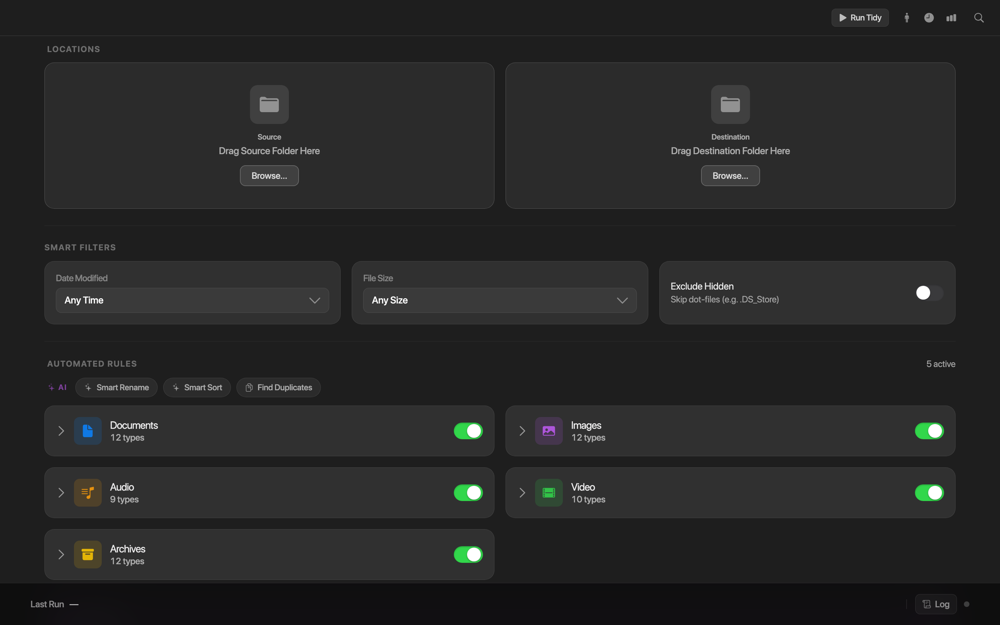

# Tidy — File Organizer

Tidy is a modern, beautifully designed file-organizing app for macOS, packed with powerful features to help you keep your directories clean. Built around standard macOS interface principles but with a dynamic, contemporary UI, Tidy brings elegance and simplicity to what's usually a tedious task.

* 🎨 **[Live Interactive Storybook](https://esm000ve.github.io/tidy/)** — Explore the stateless component library.



## Features

- **Dynamic Theme** — Light, Dark, and System appearance.
- **Rule Engine** — Visually build rules to filter files by type, extension, string match, and date ranges.
- **Natural Language Parsing** — Type *"Move all images from last week into my Archives"* and let the AI generate a rule for you.
- **Preview Operations** — Inspect exactly what will be moved and where *before* running any destructive operation. Handles file collisions and duplicates gracefully.
- **Intelligent Insights** — Detects common patterns in your folders and suggests rules that might save you time.
- **Automated Scheduling** — Run cleanups automatically with a visually stunning time picker.
- **Accessibility** — Built-in accessibility panel and audit log.

## Tech Stack

- [Electron](https://www.electronjs.org/) + [Vite](https://vitejs.dev/)
- [React 18](https://react.dev/) + [TypeScript](https://www.typescriptlang.org/)
- [Tailwind CSS](https://tailwindcss.com/) + [Radix UI](https://www.radix-ui.com/) / [shadcn/ui](https://ui.shadcn.com/)
- [Google Gemini](https://ai.google.dev/) for natural-language features

## Requirements

- **macOS 11 (Big Sur) or later**
- **Node.js 18+** and npm
- *(Optional)* A free [Google Gemini API key](https://aistudio.google.com/apikey) to enable the AI features

### AI features & your API key

The natural-language rule parser and Smart Rename use Google's Gemini API. **Each user supplies their own key** — nothing is bundled with the app.

- **In the app:** open **Preferences (⌘,)** → **AI Features** and paste your key. It's stored locally on your Mac and never leaves it.
- **Without a key:** the app runs normally; AI features fall back to a local heuristic.
- **For development:** you can instead set `GEMINI_API_KEY` in a `.env` file (see below).

## Getting Started

### 1. Clone and install

```bash
git clone https://github.com/ESm000ve/tidy.git
cd tidy
npm install
```

### 2. Configure your API key (optional, dev only)

For local development you can put a Gemini key in a `.env` file. End users of the packaged app don't need this — they set their key in Preferences (⌘,).

```bash
cp .env.example .env
# then edit .env and paste in your key
```

### 3. Run in development

```bash
npm run dev
```

This launches the Vite dev server and opens the Electron app with hot reload.

## Building a Distributable App

`npm run build` produces signed `.dmg` and `.zip` files for both Apple Silicon and Intel Macs in the `dist/` directory:

| Architecture           | Output                              |
| ---------------------- | ----------------------------------- |
| Apple Silicon (M-series) | `dist/arm64/Tidy-<version>-arm64.dmg` |
| Intel (x64)            | `dist/x64/Tidy-<version>-x64.dmg`   |

```bash
npm run build
```

### ⚠️ Sharing the app with others (Gatekeeper)

These builds use **ad-hoc signing** unless you configure your own Apple Developer certificates, so on another Mac users may see a *"damaged"* or *"unidentified developer"* warning.

To open it anyway:

1. Drag **Tidy** into the `/Applications` folder.
2. In **Terminal**, run:
   ```bash
   xattr -cr /Applications/Tidy.app
   ```
3. Open the app normally.

For a proper public release, configure **notarization** by adding your Apple ID credentials to the `electron-builder` configuration in `package.json`.

## Project Structure

```
electron/        Electron main & preload processes (file ops, scheduling, AI)
src/app/         React UI — components, rule engine, screens
src/styles/      Tailwind, fonts, and theme styles
build/           App icon and macOS entitlements (packaging assets)
```

## License

[MIT](LICENSE) © 2026 Eric Auzenne

## Attributions

See [ATTRIBUTIONS.md](ATTRIBUTIONS.md) for third-party components and assets.
